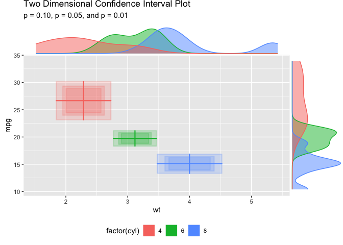

ggBoxes: Two Dimensional Box and Error Plots
================

To install the development version of the package, use the `remotes`
package:

``` r
remotes::install_github('jbryer/ggBoxes')
```

## Two Dimensional Box and Whisker Plots

Basic example using the `mtcars` dataset.

``` r
library(ggBoxplot2d)
#> Loading required package: ggplot2
data(mtcars)
ggplot(mtcars, aes(x = wt, y = mpg, group = factor(cyl),
                   color = factor(cyl), fill = factor(cyl))) +
    geom_boxplot2d() +
    theme(legend.position = 'bottom') +
    ggtitle('Two Dimensional Box Plot')
```

<!-- -->

## Two Dimensional Confidence Intervals (Error Boxes)

``` r
p <- ggplot(mtcars, aes(x = wt, y = mpg, group = factor(cyl),
                   color = factor(cyl), fill = factor(cyl))) +
    geom_errorbox2d() +
    theme(legend.position = 'bottom') +
    ggtitle('Two Dimensional Error Plot')
ggExtra::ggMarginal(p + geom_point(alpha = 0), 
                    type = 'density', 
                    groupColour = TRUE, 
                    groupFill = TRUE)
```

<!-- -->
