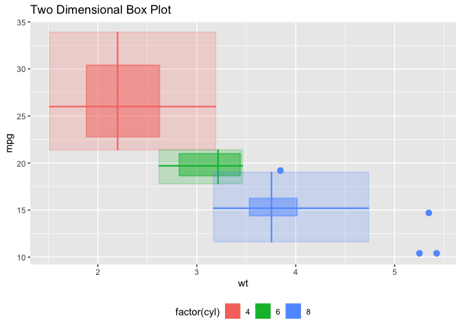

ggBoxplot2d: Two Dimensional Box and Whisker Plots
================

Two Dimensional Box and Whisker Plots

To install the development version of the package, use the `remotes`
package:

``` r
remotes::install_github('jbryer/ggBoxplot2d')
```

Basic example using the `mtcars` dataset.

``` r
library(ggBoxplot2d)
#> Loading required package: ggplot2
data(mtcars)
p <- ggplot(mtcars, aes(x = wt, y = mpg, group = factor(cyl), color = factor(cyl), fill = factor(cyl))) +
    geom_boxplot2d() +
    theme(legend.position = 'bottom')
p
```

<!-- -->
